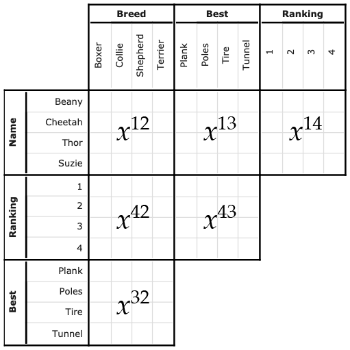

```{r setup, include=FALSE}
library(knitr)
library(kableExtra)
opts_chunk$set(echo = FALSE)
library(magrittr)
library(ggplot2)
library(patchwork)
library(dplyr)
```
```{css}
a.wiki-preview {
  color: #0645ad;
    text-decoration: none;
  border-bottom: 1px dotted #0645ad;
}
.wiki-preview::after {
  font-family: serif;
  content: " W";
  vertical-align: super;
  font-size: 6pt;
}
.d-article-with-toc > ol > li {
  margin-bottom: 0 !important;
}
#TOC > ol > li {
margin-bottom: 0.9em;
}
```

<!-- https://chimeces.com/context-cards/ -->
<script src="context-cards.js"></script>

# Introduction

A <a href="https://en.wikipedia.org/wiki/Logic_puzzle#Logic_grid_puzzles" class='wiki-preview' data-wiki-lang='en' data-wiki-title='Logic puzzle'>logic grid puzzle</a> involves:

- a scenario
- an objective; e.g. figure out who owns what color house and what salary they have
- some clues (givens); e.g. "the woman in the red house has the largest salary"

Setting it up as a grid of matrices helps with solving the puzzle. Then once all the knowns are marked using the clues, we can proceed by elimination and deduction.

```{r, fig.width=10, fig.height=10, out.width=500, out.height=500, fig.cap="An example of a 3-variable grid for solving a logic puzzle.", fig.align='center'}
x <- tibble(i = c("A", "C"), j = c("Y", "X"), k = c("-", "-"))
y <- tibble(
  i = c("A", "A", "A", "B", "C"),
  j = as.character(c(1:3, 1, 1)),
  k = c("+", "-", "-", "-", "-")
)
z <- tibble(
  i = c("1", "1", "2", "2", "2", "1", "3"),
  j = c("X", "Y", "X", "Y", "Z", "X", "Y"),
  k = c("-", "-", "-", "+", "-", "-", "-")
)

make_grid <- function(df) {
  ggplot(df, aes(x = j, y = i)) +
    geom_vline(xintercept = c(0.5, 1.5, 2.5, 3.5)) +
    geom_hline(yintercept = c(0.5, 1.5, 2.5, 3.5)) +
    geom_text(aes(label = k), size = 24) +
    labs(x = NULL, y = NULL) +
    theme_bw(base_size = 32, base_family = "Source Sans Pro")
}

p1 <- make_grid(x) +
  scale_y_discrete("Variable 1", limits = rev(c("A", "B", "C")), expand = c(0, 0.5)) +
  scale_x_discrete("Variable 2", limits = c("X", "Y", "Z"), position = "top", expand = c(0, 0.5))
p2 <- make_grid(y) +
  scale_y_discrete(limits = rev(c("A", "B", "C")), expand = c(0, 0.5), position = "right") +
  scale_x_discrete("Variable 3", limits = c("1", "2", "3"), position = "top", expand = c(0, 0.5))
p3 <- make_grid(z) +
  scale_y_discrete("Variable 2", limits = rev(c("1", "2", "3")), expand = c(0, 0.5)) +
  scale_x_discrete(limits = c("X", "Y", "Z"), position = "bottom", expand = c(0, 0.5))
p1 + p2 + p3 + plot_layout(ncol = 2, nrow = 2)
```

```{r}
tibble(
  v1 = c("A", "B", "C"),
  v2 = rep("", 3),
  v3 = c("1", "", "")
) %>%
  kable(
    col.names = c("Variable 1", "Variable 2", "Variable 3"),
    align = rep("c", 3),
    caption = "The solution table which is filled out as combinations are figured out."
  ) %>%
  kable_styling(bootstrap_options = "striped")
```

OMPR (Optimization Modelling Package)[@r-ompr] is a package for R[@r-base] which provides a language for modeling and solving <a href="https://en.wikipedia.org/wiki/Linear_programming#Integer_unknowns" class='wiki-preview' data-wiki-lang='en' data-wiki-title='Linear programming'>mixed integer linear programs</a>. Once a model is specified, we can try solving it using the **ompr.roi**[@r-ompr-roi] interface to R Optimization Infrastructure[@r-roi] and a solver (e.g. <a href="https://en.wikipedia.org/wiki/GNU_Linear_Programming_Kit" class='wiki-preview' data-wiki-lang='en' data-wiki-title='GNU Linear Programming Kit'>GLPK</a> via **ROI.plugin.glpk**[@r-roi-glpk]).

<aside>Use `brew install glpk` to install on macOS using [Homebrew](https://brew.sh/)</aside>

One may model a <a href="https://en.wikipedia.org/wiki/Sudoku" class='wiki-preview' data-wiki-lang='en' data-wiki-title='Sudoku'>Sudoku puzzle</a> as a <a href="https://en.wikipedia.org/wiki/Constraint_satisfaction_problem" class='wiki-preview' data-wiki-lang='en' data-wiki-title='Constraint satisfaction problem'>constraint satisfaction problem</a> using OMPR[^sudoku-ompr]. Similarly, I decided to try coding a logic grid puzzle as an integer program to be able to solve it automatically. This post isn't really about logic grid puzzles and it's not really about OMPR[^learn-ompr], it's really about **_formalizing a problem into math and then expressing that math as code_**.

<aside>By the way, the point of these puzzles is to exercise your own deductive reasoning, so having the computer solve them for you defeats the point.</aside>

[^sudoku-ompr]: See [this article](https://dirkschumacher.github.io/ompr/articles/problem-sudoku.html)

[^learn-ompr]: For that I would recommend [these articles in its documentation](https://dirkschumacher.github.io/ompr/articles/).

# Coding examples

```{r pkgs, echo=TRUE}
library(magrittr)
library(ompr)
library(ompr.roi)
library(ROI.plugin.glpk)
```

We will specify our model by breaking up the overall logic grid into sub-grids

- $x^{12}$ (`x12`) is the grid with people as rows and years as columns
- $x^{13}$ (`x13`) is the grid with people as rows and destinations as columns
- $x^{32}$ (`x32`) is the grid with destinations as rows and years as columns

and placing constraints on its $n$ rows and $n$ columns. For example, the first grid -- containing variable 1 (as rows $i = 1, \ldots, n$) and variable 2 (as columns $j = 1, \ldots, n$) -- is $x^{12}$ and the constraints are specified as follows:

$$\begin{aligned}
x^{12}_{i,j} \in \{0, 1\} & ~\mathrm{for~all}~i,j = 1, \ldots, n\\
\sum_{i = 1}^n x^{12}_{i,j} = 1 & ~\mathrm{for~all}~j = 1, \ldots, n\\
\sum_{j = 1}^n x^{12}_{i,j} = 1 & ~\mathrm{for~all}~i = 1, \ldots, n
\end{aligned}$$

which constrains each column and each row to contain at most one 1.

## 3-variable model specification

In the first example we will solve the very easy puzzle ["Basic 3" from Brainzilla](https://www.brainzilla.com/logic/logic-grid/basic-3/). In it, 4 people (Amanda, Jack, Mike, and Rachel) traveled to 4 destinations (London, Rio de Janeiro, Sydney, and Tokyo) between 2013 and 2016. Our goal is to figure out who travelled where and when based on some clues to get us started:

1. Neither Amanda nor Jack traveled in 2015.
2. Mike didn't travel to South America.
3. Rachel traveled in 2014.
4. Amanda visited London.
5. Neither Mike nor Rachel traveled to Japan.
6. A man traveled in 2016.

and the rest we have to deduce. We start by building a [MILP Model](https://dirkschumacher.github.io/ompr/articles/milp-modelling.html) with the grids as variables, a set of constraints on those variables, and no objective function to optimize:

```{r example1a, echo=TRUE}
n <- 4

model3 <- MILPModel() %>%
  # 3 grids:
  add_variable(x12[i, j], i = 1:n, j = 1:n, type = "binary") %>%
  add_variable(x13[i, j], i = 1:n, j = 1:n, type = "binary") %>%
  add_variable(x32[i, j], i = 1:n, j = 1:n, type = "binary") %>%
  
  # No objective:
  set_objective(0) %>%
  
  # Only one cell can be assigned in a row:
  add_constraint(sum_expr(x12[i, j], j = 1:n) == 1, i = 1:n) %>%
  add_constraint(sum_expr(x13[i, j], j = 1:n) == 1, i = 1:n) %>%
  add_constraint(sum_expr(x32[i, j], j = 1:n) == 1, i = 1:n) %>%
  
  # Only one cell can be assigned in a column:
  add_constraint(sum_expr(x12[i, j], i = 1:n) == 1, j = 1:n) %>%
  add_constraint(sum_expr(x13[i, j], i = 1:n) == 1, j = 1:n) %>%
  add_constraint(sum_expr(x32[i, j], i = 1:n) == 1, j = 1:n)
```

<aside>We are setting `n` here because we are building the model step-by-step. It would actually be better to wrap this model-building code in a `make_model` function with parameter `n`. Then it would be easy to generate a model where each of the three variables can take on 3 or 5 values.</aside>

Finally, we want to encode deductions like

$$
\mathrm{if}~x^{12}_{i,j} = 1~\mathrm{and}~x^{13}_{i,k} = 1,~\mathrm{then}~x^{32}_{k,j} = 1
$$

One way to do this would be setting a constraint:

$$
x^{12}_{i,j} \times x^{13}_{i,k} = x^{32}_{k,j}
$$

because for $x^{32}_{k,j}$ to be 1, both $x^{12}_{i,j}$ and $x^{13}_{i,k}$ would have to be 1. If either is 0 (false), then it follows that $x^{32}_{k,j}$ must also be 0.

I'll be honest, dear reader, I have no idea how to code this[^error]. On a whim, I tried the following and it worked:

```{r example1b, echo=TRUE}
model3 <- model3 %>%
  add_constraint(x12[i, j] + x13[i, k] <= x32[k, j] + 1, i = 1:n, j = 1:n, k = 1:n)
```

[^error]: `add_constraint(model3, x12[i, j] * x13[i, k] == x32[k, j], i = 1:n, j = 1:n, k = 1:n)`, while intuitive, results in the following error: `Error in x12[i, j] * x13[i, k] : non-numeric argument to binary operator`

I reasoned that the only way for `x32[k, j]` to be 1 under this constraint would be for `x12[i, j]` and `x13[i, k]` to both be 1, which is what we want. That is, it prevents `x32[k, j]` from being 0 if `x12[i, j]` and `x13[i, k]` are both 1. It's not perfect, but it works???

Now we are ready to translate the clues into additional constraints:

```{r example1c, echo=TRUE}
model3_fixed <- model3 %>%
  # 1. Neither Amanda (1) nor Jack (2) traveled in 2015 (3):
  add_constraint(x12[i, 3] == 0, i = 1:2) %>%
  # 2. Mike (3) didn't travel to South America (2):
  add_constraint(x13[3, 2] == 0) %>%
  # 3. Rachel (4) traveled in 2014 (2):
  add_constraint(x12[4, 2] == 1) %>%
  # 4. Amanda (1) visited London (1):
  add_constraint(x13[1, 1] == 1) %>%
  # 5. Neither Mike (3) nor Rachel (4) traveled to Japan (4):
  add_constraint(x13[i, 4] == 0, i = c(3, 4)) %>%
  # 6. A man (2 or 3 => neither 1 nor 4) traveled in 2016 (4):
  add_constraint(x12[i, 4] == 0, i = c(1, 4))
```

```{r example1d, echo=TRUE, message=TRUE}
result3 <- solve_model(model3_fixed, with_ROI(solver = "glpk", verbose = TRUE))
```

```{r example1e, echo=TRUE}
# For changing indices to labels:
Is <- c("Amanda", "Jack", "Mike", "Rachel")
Js <- c("2013", "2014", "2015", "2016")
Ks <- c("London", "Rio de Janeiro", "Sydney", "Tokyo")

# Extracting the solution to each grid:
solution3 <- list(
  x12 = get_solution(result3, x12[i, j]) %>%
    dplyr::filter(value == 1) %>%
    dplyr::select(-c(variable, value)) %>%
    dplyr::mutate(i = Is[i], j = Js[j]),
  x13 = get_solution(result3, x13[i, k]) %>%
    dplyr::filter(value == 1) %>%
    dplyr::select(-c(variable, value)) %>%
    dplyr::mutate(i = Is[i], k = Ks[k]),
  x32 = get_solution(result3, x32[k, j]) %>%
    dplyr::filter(value == 1) %>%
    dplyr::select(-c(variable, value)) %>%
    dplyr::mutate(k = Ks[k], j = Js[j])
)

# Obtained solution:
solution3 %>%
  purrr::reduce(left_join) %>%
  dplyr::arrange(i) %>%
  kable(col.names = c("Person", "Year", "Destination"), align = "l") %>%
  kable_styling(bootstrap_options = c("striped"))
```

...which should match the solution we would obtain by elimination:

```{r example1_solution}
tibble(
  Person = c("Amanda", "Jack", "Mike", "Rachel"),
  Year = c("2013", "2016", "2015", "2014"),
  Destination = c("London", "Tokyo", "Sydney", "Rio de Janeiro")
) %>%
  dplyr::arrange(Person) %>%
  kable(align = "l") %>%
  kable_styling(bootstrap_options = c("striped"))
```

## 4-variable model spec with relative constraints

In this second example, we will solve the medium-difficulty puzzle ["Agility Competition" from Brainzilla](https://www.brainzilla.com/logic/logic-grid/agility-competition/) in which four dogs took part in an agility competition. Our goal is to figure out the combination of: the dog's name, the breed, the task they were best in, and which place they ranked in. We are given the following clues:

1. Only the winning dog has the same initial letter in name and breed.
2. The Boxer ranked 1 position after the Shepherd. None of them likes the tunnel, nor jumping through the tire.
3. Cheetah and the dog who loves the poles were 1st and 3rd.
4. Thor doesn't like the plank and didn't come 2nd.
5. Cheetah either loves the tunnel or she came 4th.
6. The dog who loves the plank came 1 position after the dog who loves the poles.
7. Suzie is not a Shepherd and Beany doesn't like the tunnel

This is the map we will use to refer to the grids:

```{r, fig.align='center', fig.cap='Figure from https://www.brainzilla.com, modified to show grid mapping', out.extra='class=external', out.width=500, out.height=500}

```

First, we will add the extra grids and place the row-column constraints on them as we did before. Because of the way we have chosen to write our model, extending it to 4 variables (which yields 3 additional grids) means we can build on what we already have:

```{r example2a, echo=TRUE}
model4 <- model3 %>%
  # 3 additional grids:
  add_variable(x14[i, j], i = 1:n, j = 1:n, type = "binary") %>%
  add_variable(x42[i, j], i = 1:n, j = 1:n, type = "binary") %>%
  add_variable(x43[i, j], i = 1:n, j = 1:n, type = "binary") %>%
  
  # Only one cell can be assigned in a row, as before:
  add_constraint(sum_expr(x14[i, j], j = 1:n) == 1, i = 1:n) %>%
  add_constraint(sum_expr(x42[i, j], j = 1:n) == 1, i = 1:n) %>%
  add_constraint(sum_expr(x43[i, j], j = 1:n) == 1, i = 1:n) %>%
  
  # Only one cell can be assigned in a column, as before:
  add_constraint(sum_expr(x14[i, j], i = 1:n) == 1, j = 1:n) %>%
  add_constraint(sum_expr(x42[i, j], i = 1:n) == 1, j = 1:n) %>%
  add_constraint(sum_expr(x43[i, j], i = 1:n) == 1, j = 1:n) %>%

  # Additional logic:
  add_constraint(x12[i, j] + x14[i, k] <= x42[k, j] + 1, i = 1:n, j = 1:n, k = 1:n) %>%
  add_constraint(x13[i, j] + x14[i, k] <= x43[k, j] + 1, i = 1:n, j = 1:n, k = 1:n) %>%
  add_constraint(x42[i, j] + x43[i, k] <= x32[k, j] + 1, i = 1:n, j = 1:n, k = 1:n)
```

<aside>Following up on the note from before. If we were wrapping the model-building code in a `make_model` function, we could add a second parameter `p = 3` which controls how many variables there are. Inside the function we can then check if `p == 4` and run this model-extending code before outputting the model.</aside>

With the model specified, we can now translate the clues into constraints. You might recall that one of the clues is "The Boxer (1) ranked 1 position after the Shepherd (3)", which we can't specify in a fixed way. The key here will be to utilize the $x$ variables as indicator variables to *fetch*[^dad-joke] the indices from $x^{42}$ (the grid with positions as rows and breeds as columns):

$$\begin{aligned}
\mathrm{Boxer~position} & = \sum_{i = 1}^n i \times x^{42}_{i,1}\\
\mathrm{Shepherd~position} & = \sum_{i = 1}^n i \times x^{42}_{i,3}\\
\mathrm{Boxer~~position} & = \mathrm{Shepherd~position} + 1
\end{aligned}$$

[^dad-joke]: pun intended :D

```{r example2b, echo=TRUE}
model4_fixed <- model4 %>%
  # 2. The Boxer (1) ranked 1 position after the Shepherd (3):
  add_constraint(x42[1, 1] == 0) %>% # Boxer cannot be 1st
  add_constraint(x42[4, 3] == 0) %>% # Shepherd cannot be 4th
  add_constraint(sum_expr(i * x42[i, 1], i = 1:4) == sum_expr(i * x42[i, 3], i = 1:4) + 1) %>%
  #    None of them likes the tunnel (4), nor jumping through the tire (3):
  add_constraint(x32[i, 1] == 0, i = 3:4) %>% # Boxer's dislikes
  add_constraint(x32[i, 3] == 0, i = 3:4) %>% # Shepherd dislikes
  
  # 3. Cheetah (2) and the dog who loves the poles (2) were 1st and 3rd:
  add_constraint(x13[2, 2] == 0) %>% # Cheetah cannot like poles
  add_constraint(x14[2, 1] == 1) %>% # Cheetah is in 1st position
  add_constraint(x43[3, 2] == 1) %>% # Dog who loves poles is in 3rd
  
  # 1. Only the winning dog has the same initial letter in name and breed:
  add_constraint(x12[2, 2] == 1) %>% # Therefore Cheetah is a Collie
  add_constraint(x12[1, 1] == 0) %>% # and Beany cannot be a Boxer
  add_constraint(x12[3, 4] == 0) %>% # and Thor cannot be a Terrier
  add_constraint(x12[4, 3] == 0) %>% # and Suzie cannot be a Shepherd
  
  # 4. Thor (3) doesn't like the plank (1) and didn't come 2nd:
  add_constraint(x13[3, 1] == 0) %>%
  add_constraint(x14[3, 2] == 0) %>%
  
  # 5. Cheetah (2) either loves the tunnel (4) or she came 4th:
  add_constraint(x13[2, 4] == 1) %>% # Since Cheetah came 1st, she must love the tunnel
  
  # 6. The dog who loves the plank (1) came 1 position after the dog who loves the poles (2):
  add_constraint(x42[1, 1] == 0) %>% # Plank cannot be 1st
  add_constraint(x42[4, 2] == 0) %>% # Poles cannot be 4th
  add_constraint(sum_expr(i * x43[i, 1], i = 1:4) == sum_expr(i * x43[i, 2], i = 1:4) + 1) %>%
  
  # 7. Suzie (4) is not a Shepherd (3) and Beany (1) doesn't like the tunnel (4):
  add_constraint(x12[4, 3] == 0)
  # We don't need anymore constraints because tunnel is already claimed by Cheetah
```

```{r example2c, echo=TRUE, message=TRUE}
result4 <- solve_model(model4_fixed, with_ROI(solver = "glpk", verbose = TRUE))
```

```{r example2d, echo=TRUE}
Is <- c("Beany", "Cheetah", "Thor", "Suzie") # name
Js <- c("Boxer", "Collie", "Shepherd", "Terrier") # breed
Ks <- c("Plank", "Poles", "Tire", "Tunnel") # best at
Ls <- as.character(1:4) # ranking

# Extract solved grids:
solution4 <- list(
  x12 = get_solution(result4, x12[i, j]) %>%
    dplyr::filter(value == 1) %>%
    dplyr::select(-c(variable, value)) %>%
    dplyr::mutate(i = Is[i], j = Js[j]),
  x13 = get_solution(result4, x13[i, k]) %>%
    dplyr::filter(value == 1) %>%
    dplyr::select(-c(variable, value)) %>%
    dplyr::mutate(i = Is[i], k = Ks[k]),
  x14 = get_solution(result4, x14[i, l]) %>%
    dplyr::filter(value == 1) %>%
    dplyr::select(-c(variable, value)) %>%
    dplyr::mutate(i = Is[i], l = Ls[l]),
  x42 = get_solution(result4, x42[l, j]) %>%
    dplyr::filter(value == 1) %>%
    dplyr::select(-c(variable, value)) %>%
    dplyr::mutate(l = Ls[l], j = Js[j]),
  x43 = get_solution(result4, x43[l, k]) %>%
    dplyr::filter(value == 1) %>%
    dplyr::select(-c(variable, value)) %>%
    dplyr::mutate(l = Ls[l], k = Ks[k]),
  x32 = get_solution(result4, x32[k, j]) %>%
    dplyr::filter(value == 1) %>%
    dplyr::select(-c(variable, value)) %>%
    dplyr::mutate(k = Ks[k], j = Js[j])
)

# Obtained solution:
solution4 %>%
  purrr::reduce(left_join) %>%
  dplyr::arrange(i) %>%
  kable(col.names = c("Dog", "Breed", "Best", "Position"), align = "l") %>%
  kable_styling(bootstrap_options = c("striped"))
```

...which should match the solution we would obtain by deduction:

```{r example2_solution}
tibble(
  Dog = c("Beany", "Cheetah", "Thor", "Suzie"),
  Breed = c("Terrier", "Collie", "Shepherd", "Boxer"),
  Best = c("Tire", "Tunnel", "Poles", "Plank"),
  Position = c(2, 1, 3, 4)
) %>%
  dplyr::arrange(Dog) %>%
  kable(align = "l") %>%
  kable_styling(bootstrap_options = c("striped"))
```

# Further reading and other software

OMPR was inspired by [JuMP](https://github.com/JuliaOpt/JuMP.jl) package, part of [JuliaOpt](http://www.juliaopt.org/) family of optimization packages for Julia. If you are interested in mathematical modeling and optimization in Python, check out [Pyomo](http://www.pyomo.org/). (And [its documentation](https://pyomo.readthedocs.io/en/latest/).)

[This post from Jeff Schecter ](https://multithreaded.stitchfix.com/blog/2018/06/21/constrained-optimization/) is an insightful introduction to <a href="https://en.wikipedia.org/wiki/Constrained_optimization" class='wiki-preview' data-wiki-lang='en' data-wiki-title='Constrained optimization'>constrained optimization</a> (using Pyomo) with the application of matching clients with stylists at <a href="https://en.wikipedia.org/wiki/Stitch_Fix" class='wiki-preview' data-wiki-lang='en' data-wiki-title='Stitch Fix'>Stitch Fix</a>. By the way, I highly recommend subscribing to [MultiThreaded blog](https://multithreaded.stitchfix.com/blog/) for really interesting and informative articles about technology and data science being used at Stitch Fix.

**P.S.** If you liked this post, you may be interested in my [tutorial on Bayesian optimization in R](https://bearloga.github.io/bayesopt-tutorial-r/).

# Acknowledgements {.appendix}

You might have noticed a few blue links with "W"s on this page. Those are links to the Wikipedia articles on those topics and if you hover over them, you will see a preview of the article. This is possible with the [ContextCards library](https://chimeces.com/context-cards/) developed by my coworker Joaquin over at Wikimedia, based on the [Popups extension for MediaWiki](https://www.mediawiki.org/wiki/Extension:Popups).
